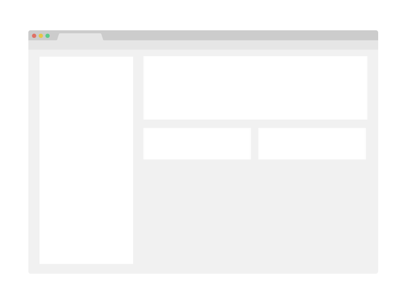

# Momanyi Hassan | Full-Stack Developer Portfolio

Welcome to the repository for my personal developer portfolio. This project is a highly interactive, responsive, and performance-optimized Single Page Application (SPA) designed to showcase my skills in Full-Stack Web Development, Cybersecurity, and Network Architecture.



## 🌐 Live Demo

**[View Live Portfolio](https://fullstop125.github.io/My-Portfolio/)**

## ✨ Key Features

- **Modern Tech Stack:** Built with React 18, Vite, and Tailwind CSS for lightning-fast hot module replacement and utility-first styling.
- **Interactive 3D Animations:** Features a custom "CyberCore" interactive 3D model built with Three.js and React Three Fiber to showcase my 2D/3D media capabilities.
- **Elite UI/UX:** Incorporates Framer Motion for smooth scroll-triggered "Terminal Reveal" animations, glitch effects, and complex state transitions.
- **Dark Mode Support:** Fully implements Tailwind's class-based dark mode, persisting user preferences via `localStorage`.
- **Live GitHub Activity:** Dynamically fetches and displays my live GitHub contribution graph.
- **Asynchronous Forms:** Contact form handles submissions quietly in the background via Formspree API with beautiful success feedback (no redirects).
- **Automated Workflow:** Includes a custom Node.js CLI script to easily scaffold and add new project case studies without manually editing JSON data.

## 🛠 Built With

*   **Framework:** [React.js](https://reactjs.org/) (v18)
*   **Bundler:** [Vite](https://vitejs.dev/)
*   **Styling:** [Tailwind CSS](https://tailwindcss.com/)
*   **Animations:** [Framer Motion](https://www.framer.com/motion/)
*   **3D Rendering:** [Three.js](https://threejs.org/) & [@react-three/fiber](https://docs.pmnd.rs/react-three-fiber/getting-started/introduction)
*   **Icons:** [React Icons](https://react-icons.github.io/react-icons/)
*   **Deployment:** GitHub Pages & GitHub Actions

## 💻 Running Locally

To get a local copy up and running, follow these simple steps.

### Prerequisites
Make sure you have Node.js and npm installed on your machine.

### Installation

1. Clone the repository:
   ```sh
   git clone https://github.com/fullstop125/My-Portfolio.git
   ```
2. Navigate into the directory:
   ```sh
   cd My-Portfolio
   ```
3. Install NPM packages:
   ```sh
   npm install
   ```
4. Start the Vite development server:
   ```sh
   npm run dev
   ```
5. Open your browser and visit `http://localhost:5173`.

## 🚀 Adding New Projects (CLI Tool)

I have built a custom Node.js script to make adding new projects to the portfolio completely seamless. 

Instead of manually editing the `src/data/projects.json` file, simply run:
```sh
npm run add-project
```
The terminal will prompt you for the project details (Title, Role, Description, Image path, Live URLs, etc.) and automatically inject the new project at the top of the portfolio.

*(Note: Ensure your project screenshot is placed in the `public/images/about-image/` directory).*

## 🚢 Deployment

This portfolio uses `gh-pages` for deployment. To build the production app and deploy it to the live branch, run:
```sh
npm run deploy
```

## 👤 Author

**Momanyi Hassan**
- GitHub: [@fullstop125](https://github.com/fullstop125)
- LinkedIn: [momanyi-hassan](https://linkedin.com/in/momanyi-hassan-32a489180)
- Twitter: [@moseshassany](https://twitter.com/moseshassany)

## 🤝 Contributing

Contributions, issues, and feature requests are welcome!
Feel free to check the [issues page](https://github.com/fullstop125/My-Portfolio/issues).

## ⭐️ Show your support

Give a ⭐️ if you like this project!

## 📝 License

This project is [MIT](./LICENSE) licensed.
